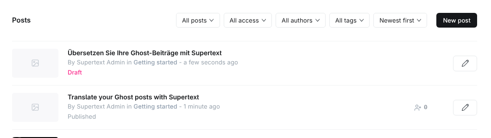

# Supertext Translation for Ghost

Translate Ghost posts and pages with [Supertext](https://www.supertext.com) AI translation. Add a tag such as `#translate-de-ch` to a post, and a translated **draft** appears in Ghost Admin a few seconds later, with formatting, links and cards intact.

Ghost has no plugin system for its admin, so this is a small **connector service** that works through Ghost's own features: internal tags to request translations, webhooks to hear about them, and the Admin API to create the translated drafts. It never writes to the post you are editing.

| | |
| --- | --- |
| **Editors** | [User guide](docs/USER_GUIDE.md): request, review and publish translations |
| **Administrators** | [Installation guide](docs/INSTALLATION.md): run the connector, API key, languages, settings, troubleshooting |
| **Developers** | [Developer guide](docs/DEVELOPER.md): architecture, Supertext protocol, tests, demo, releasing |



## At a glance

- Ghost 6 (Lexical editor). Posts and pages.
- Translates the title, excerpt, SEO and social fields, feature image alt text and caption, every paragraph, heading, list and quote, and the text in cards (images, galleries, callouts, toggles, buttons, headers, signup, call-to-action, product, embeds, video, audio, files).
- One translation per language, linked to its source. Drafts that nobody touched are updated in place; edited or published translations are only replaced on request.
- Status page for staff at `/ghost/supertext/` when the connector runs in front of Ghost.
- Demo: Ghost + connector in one Docker image (`demo/`), deployed on Railway.

## Quick start (Docker)

```bash
docker build -f demo/Dockerfile -t ghost-supertext .
docker run -p 8080:8080 -v ghost-content:/var/lib/ghost/content \
  -e url=https://blog.example.com \
  -e DEMO_ADMIN_EMAIL=you@example.com -e DEMO_ADMIN_PASSWORD='a long password' \
  -e SUPERTEXT_API_KEY=... ghost-supertext
```

See the [installation guide](docs/INSTALLATION.md) for adding the connector to an existing Ghost site.

## License

MIT, © Supertext AG
