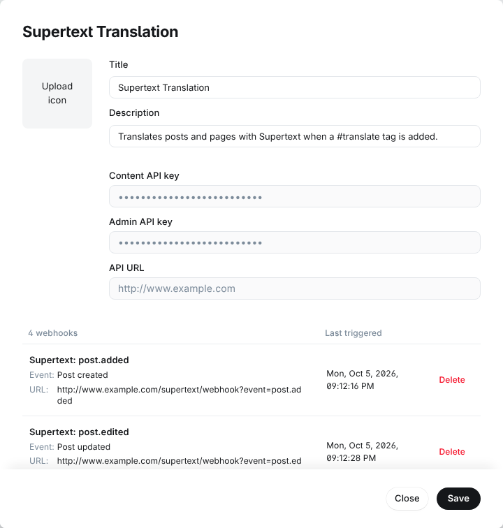
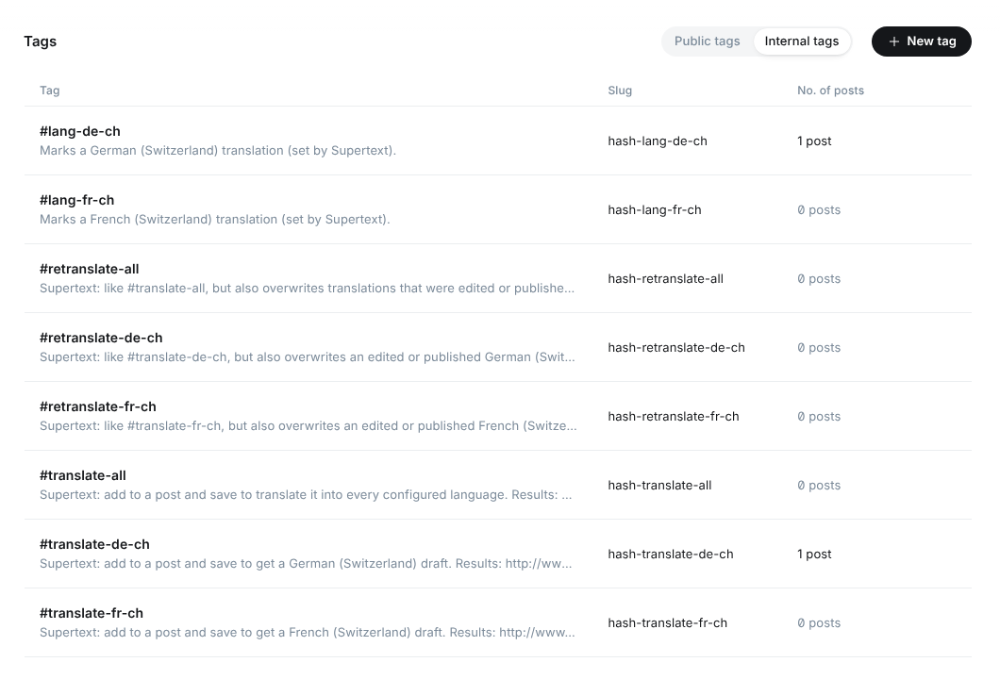
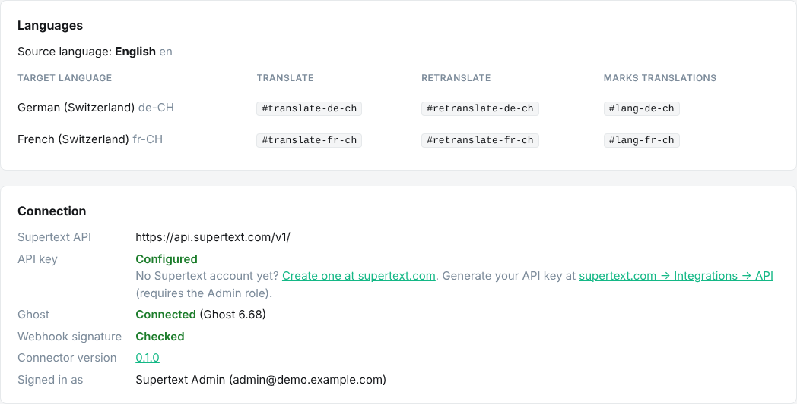

# Installation guide

For administrators. The Supertext connector is a small Node.js service next to your Ghost site. Ghost tells it through webhooks when an editor adds a `#translate-…` tag, and it writes the translation back through Ghost's Admin API.

## Requirements

- Ghost **6** (self-hosted or Ghost(Pro)). Posts must use Ghost's current (Lexical) editor, which is the default since Ghost 5.
- Node.js **20.9** or newer for the connector (or Docker).
- A Supertext account with an API key ([create an account](https://www.supertext.com/person/en/account/signin); [generate the key](https://www.supertext.com/en/integrations/api) with the Admin role; see [API key](#api-key)).
- The connector must be reachable by Ghost over the internet, or on your Ghost site's own host name (see [Choose a setup](#choose-a-setup)).
- Ghost Administrator access, to create the integration.

## Choose a setup

Ghost refuses to send webhooks to private network addresses (`127.0.0.1`, `10.x`, `192.168.x`, Docker networks) **unless** the address is your site's own URL. That decides how you run the connector:

| Setup | When | What you get |
| --- | --- | --- |
| **A. In front of Ghost** (recommended) | You host Ghost yourself (Docker, VPS, Ghost-CLI). | The connector sits between your web server and Ghost. Webhooks go to your own site URL. Includes the staff status page at `/ghost/supertext/`. |
| **B. Standalone** | Ghost(Pro), or you can't change the web server. | The connector runs on its own public URL. Everything works except the status page; results are in the connector's log. |

### A. In front of Ghost

Run the connector with `GHOST_UPSTREAM` set to Ghost's internal address. It answers `/supertext/…` and `/ghost/supertext/` itself and passes every other request to Ghost unchanged.

Either send **all** traffic to the connector (simplest), or keep your web server in front and send only these two paths to it. For example with nginx, where Ghost listens on port 2368 and the connector on 8080:

```nginx
location /supertext/        { proxy_pass http://127.0.0.1:8080; proxy_set_header Host $host; proxy_set_header X-Forwarded-Proto $scheme; }
location /ghost/supertext/  { proxy_pass http://127.0.0.1:8080; proxy_set_header Host $host; proxy_set_header X-Forwarded-Proto $scheme; }
location /                  { proxy_pass http://127.0.0.1:2368; proxy_set_header Host $host; proxy_set_header X-Forwarded-Proto $scheme; }
```

The status page lives under `/ghost/` because Ghost's login cookie is only sent to that path; the connector uses it to check that the visitor is signed in to Ghost Admin.

### B. Standalone

Run the connector anywhere with a public HTTPS address (a small container on Railway, Fly.io, Render…). Leave `GHOST_UPSTREAM` empty.

## Install

The connector is not published to npm yet; run it from this repository.

```bash
git clone https://github.com/Supertext/Ghost-Supertext-Translation.git
cd Ghost-Supertext-Translation
npm ci && npm run build
GHOST_URL=https://blog.example.com \
GHOST_ADMIN_API_KEY=… GHOST_WEBHOOK_SECRET=… \
SUPERTEXT_API_KEY=… TARGET_LANGUAGES=de-CH,fr-CH \
GHOST_UPSTREAM=http://127.0.0.1:2368 \
npm start
```

Keep it running with your process manager (systemd, pm2, Docker). On start it logs its languages and, once it can reach Ghost, `Ghost connection OK, tags in place`.

**All-in-one Docker image:** `demo/Dockerfile` builds Ghost 6 and the connector in one container (setup A, SQLite database). It is what the demo runs on; see the [developer guide](DEVELOPER.md#demo) for its variables. For production use with MySQL, run the official Ghost image and the connector side by side instead.

## Create the integration in Ghost

1. In Ghost Admin go to **Settings → Integrations → Add custom integration**, name it `Supertext Translation`.
2. Copy the **Admin API key** into `GHOST_ADMIN_API_KEY`.
3. Add four webhooks with **Add webhook**, all with the same **Secret** (any long random string, also put it into `GHOST_WEBHOOK_SECRET`):

   | Name | Event | Target URL |
   | --- | --- | --- |
   | Supertext: post.added | Post created | `https://<your site or connector>/supertext/webhook?event=post.added` |
   | Supertext: post.edited | Post updated | `…/supertext/webhook?event=post.edited` |
   | Supertext: page.added | Page created | `…/supertext/webhook?event=page.added` |
   | Supertext: page.edited | Page updated | `…/supertext/webhook?event=page.edited` |

   The `?event=` part is required: Ghost's webhook body doesn't say which event it is.



The demo creates this integration automatically.

## API key

1. **No Supertext account yet?** [Log in or create a Supertext account](https://www.supertext.com/person/en/account/signin) with your email address.
2. **Generate your API key** at [supertext.com → Integrations → API](https://www.supertext.com/en/integrations/api). This page requires the **Admin** role in your Supertext account; if you don't have it, ask an administrator of your Supertext account.
3. Set the key as `SUPERTEXT_API_KEY`.

You can paste it with or without the `Supertext-Auth-Key ` prefix Supertext shows; the connector sends it correctly either way. Never commit it to a repository.

Without a key the connector still starts, but every request fails with "No Supertext API key is configured", the startup log says `SUPERTEXT_API_KEY is not set`, and the status page shows the key as **Missing** together with the links above.

## Language setup

Ghost has no built-in multilingual content. The connector models languages the way most multilingual Ghost sites do: **one post per language, marked with an internal tag**.

- `SOURCE_LANGUAGE` is the language your editors write in (default `en`).
- `TARGET_LANGUAGES` lists the languages to translate into, separated by commas, as Supertext language codes (`de-CH`, `fr-CH`, `it-CH`, `de`, `en-GB`, …).

For each target language the connector creates three internal tags on startup (`de-CH` shown):

| Tag | Purpose |
| --- | --- |
| `#translate-de-ch` | Editors add it to request a translation. |
| `#retranslate-de-ch` | Same, but also replaces an edited or published translation. |
| `#lang-de-ch` | Set by the connector on every German (Switzerland) translation. |

plus `#translate-all` and `#retranslate-all`. You find them under **Tags → Internal tags**:



The status page shows the same configuration:



Its **Connection** section also shows the **Connector version** (from the connector's `package.json`). Ghost has no plugin list, so this is where you check which version you run, for example before and after an update; a release version links to its release notes on GitHub. The startup log shows it too (`[supertext] Connector 0.1.0 listening on …`).

### Language sections on the site

To give each language its own section on the public site, upload a `routes.yaml` under **Settings → Labs → Routes** that puts translations into their own collection. The demo uses:

```yaml
routes:

collections:
  /de-ch/:
    permalink: /de-ch/{slug}/
    template: index
    filter: tag:hash-lang-de-ch
  /fr-ch/:
    permalink: /fr-ch/{slug}/
    template: index
    filter: tag:hash-lang-fr-ch
  /:
    permalink: /{slug}/
    template: index
    filter: tag:-hash-lang-de-ch+tag:-hash-lang-fr-ch

taxonomies:
  tag: /tag/{slug}/
  author: /author/{slug}/
```

Language collections must come before `/`. Then add menu links to `/de-ch/` and `/fr-ch/` under **Settings → Navigation**.

Ghost's **Publication language** (Settings → General) is one value for the whole site, so the `lang` attribute of every page stays the source language unless your theme sets it from the `#lang-…` tag.

## All settings

| Variable | Default | Meaning |
| --- | --- | --- |
| `GHOST_URL` | `url`, else `https://$RAILWAY_PUBLIC_DOMAIN` | Public URL of the Ghost site. Required. |
| `GHOST_ADMIN_API_KEY` | — | Admin API key of the custom integration (`<id>:<secret>`). Required (or via `GHOST_SETTINGS_FILE`). |
| `GHOST_WEBHOOK_SECRET` | — | Secret of the webhooks. When set, unsigned or wrongly signed webhooks are rejected. Strongly recommended. |
| `GHOST_SETTINGS_FILE` | — | JSON file with `adminKey` and `webhookSecret`, used when the variables above are empty; re-read when it changes (the demo writes it). |
| `GHOST_UPSTREAM` | — | Setup A: Ghost's internal address, e.g. `http://127.0.0.1:2368`. Enables the proxy and the status page. |
| `SUPERTEXT_API_KEY` | — | Your Supertext API key, generated at [supertext.com → Integrations → API](https://www.supertext.com/en/integrations/api) (Admin role). |
| `SUPERTEXT_API_URL` | `https://api.supertext.com/v1/` | Supertext API endpoint. |
| `SOURCE_LANGUAGE` | `en` | Language of the originals. Sent to Supertext as the primary subtag (`en-GB` → `en`). |
| `TARGET_LANGUAGES` | `de-CH,fr-CH` | Target languages, comma-separated. |
| `SUPERTEXT_POLITENESS` | `default` | Formal or informal address: `more` (formal, e.g. *Sie*/*vous*), `less` or `default`, for all languages, or per language: `de-CH=more,fr-CH=less`. |
| `PORT` / `HOST` | `8080` / `0.0.0.0` | Where the connector listens. |
| `JOBS_FILE` | — | JSON file to keep the status page's history across restarts. |

Changing `TARGET_LANGUAGES` needs a restart. New tags are created on start; tags of removed languages are left in Ghost.

## Update

`git pull && npm ci && npm run build`, then restart. Check the [changelog](../CHANGELOG.md) first.

## Uninstall

1. Delete the **Supertext Translation** integration in Ghost (this removes its webhooks and key).
2. Stop the connector and, in setup A, point your web server back at Ghost.
3. Optional: delete the `#translate-…`, `#retranslate-…` tags. Keep the `#lang-…` tags if you use them in `routes.yaml`.

Translations stay normal Ghost posts. Each carries an invisible HTML comment in its **Code injection → Site header** (`<!-- supertext:source=… -->`) that links it to its original; you can leave or remove it.

## Troubleshooting

| Symptom | Cause and fix |
| --- | --- |
| Nothing happens after adding a tag | Check the connector log for `#… posts … → de-CH`. If there's nothing, Ghost didn't deliver the webhook: look in Ghost's log for `WEBHOOK_DELIVERY_FAILURE`. |
| Ghost log: `URL resolves to a non-permitted private IP block` | The webhook points at a private address. Use the site's own URL (setup A) or a public connector URL (setup B). |
| Ghost log: `URL invalid` | Ghost rejects host names without a domain, such as `localhost`. Use a real host name. |
| Connector log: `Rejected a webhook with a missing or wrong signature` | `GHOST_WEBHOOK_SECRET` doesn't match the secret of the webhooks. |
| Connector log keeps saying `Waiting for Ghost` | The Admin API key is missing or wrong, or Ghost isn't reachable at `GHOST_UPSTREAM`/`GHOST_URL`. |
| Status page sends you to the Ghost sign-in | You're not signed in to Ghost Admin in this browser, or the page isn't served under `/ghost/supertext/` on the site's own host. |
| Status page: "only available when the connector runs in front of Ghost" | Setup B; use the connector log instead. |
| "Authentication failure. Please check your Supertext API key." | Wrong or expired `SUPERTEXT_API_KEY`. Generate a new one at [supertext.com → Integrations → API](https://www.supertext.com/en/integrations/api) (Admin role). |
| "Too many requests" | Supertext's per-second limit. The connector retries four times; translating fewer languages at once helps. |
| "No content in Ghost's current editor format" | The post was written in Ghost's legacy editor; open and save it once to convert it. |
