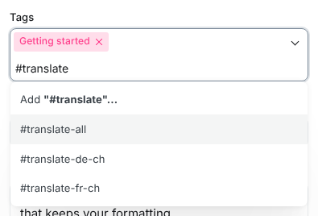
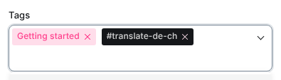
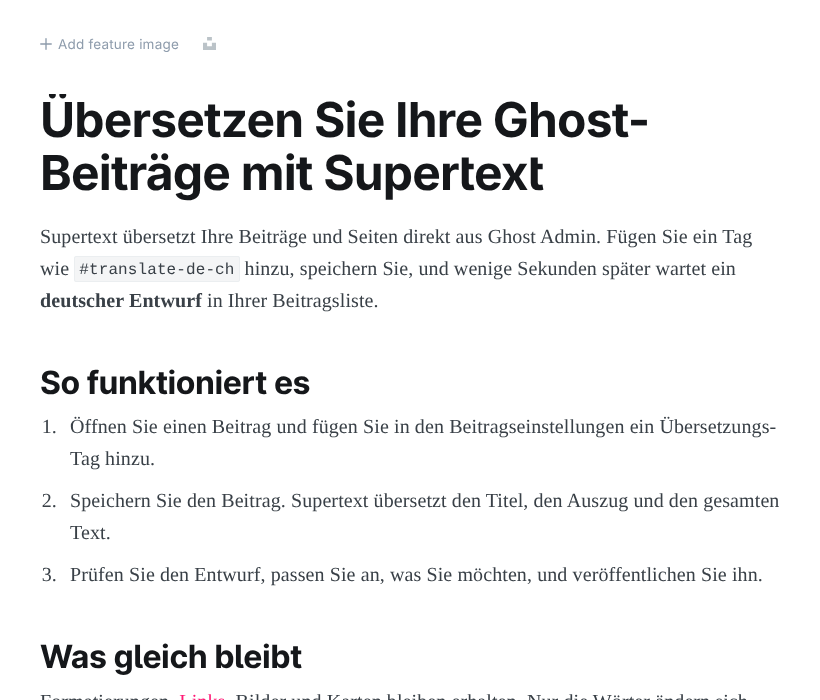
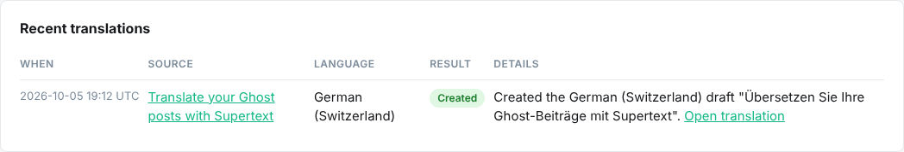
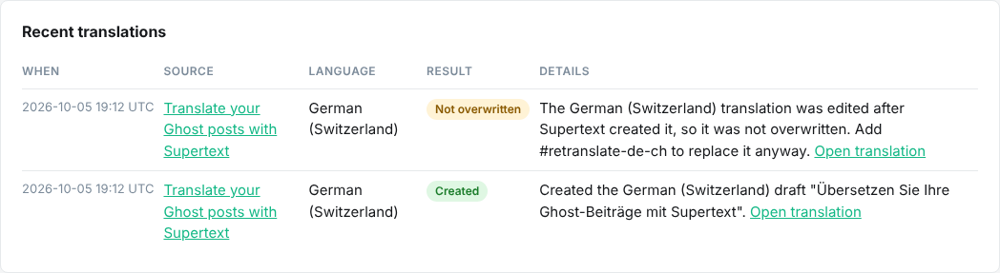

# User guide

For editors who write in Ghost Admin. Supertext translates a post or page when you add a tag to it. The translation arrives as a **draft** next to the original, so you can review it before anyone sees it.

All examples use the demo's languages, German (Switzerland) and French (Switzerland). Your site may offer other languages; the tags follow the same pattern.

## Translate a post or page

1. Open the post (or page) in Ghost Admin.
2. Open **Post settings** with the panel icon at the top right.
3. Click into **Tags** and type `#translate`. Pick the language you want:

   

   | Tag | Result |
   | --- | --- |
   | `#translate-de-ch` | a German (Switzerland) draft |
   | `#translate-fr-ch` | a French (Switzerland) draft |
   | `#translate-all` | a draft in every language your site offers |

4. That's it: Ghost saves tag changes right away, also on published posts.

   

A few seconds later the translation shows up at the top of your posts list as a draft, with the translated title:

The tag stays on your original post. That is fine: it only does something at the moment it is added.

## Review and publish

Open the draft like any other post. Everything is translated: the title, the text, headings, lists, quotes, image captions and alt texts, callouts, buttons and other cards, the excerpt and the SEO and social media texts. Bold, italic, links and the layout are the same as in the original.

Correct whatever you like, then **Publish** as usual. If your site is set up for it (the demo is), translations appear on the public site in their own section, for example `/de-ch/` for German (Switzerland), and the menu links to them.

What the translation keeps from the original: authors, public tags, feature image, post access (public, members, paid) and featured flag. It gets the tag `#lang-de-ch` (or the tag of its language), which is what puts it in the right section of the site. **Don't remove that tag.**

## See what happened

Logged-in staff can open the **Supertext status page** at `/ghost/supertext/` on your site (for example `https://blog.example.com/ghost/supertext/`). The link is also in the description of every `#translate` tag under **Tags → Internal tags**. It lists the latest requests, their result and a link to each translation:

The page refreshes itself while a translation is running.

## Translate again after changing the original

If you change the original and want the translation to follow, remove the `#translate-…` tag, then add it again.

- If the translation is still an **unchanged draft**, it is updated in place.
- If someone **edited** the translation, or it is **published**, it is left alone so nobody's work is lost. The status page shows *Not overwritten*:

  

  To replace it anyway, add `#retranslate-de-ch` (or `#retranslate-all`) to the original. This overwrites the translation's text with a fresh translation. A published translation stays published, so check it right after.

## What is not translated

- Tags, authors' names and the post URL (Ghost creates the URL from the translated title once; it is not changed later).
- HTML, Markdown and code cards, embedded content (videos, social posts), and bookmark previews (they show the linked site's own text).
- Email-only content and the newsletter subject of posts that were already sent.
- Inline code (text formatted as code) stays as written.

## Messages on the status page

| Result | Meaning | What to do |
| --- | --- | --- |
| Created | A new draft was made. | Review and publish it. |
| Updated | The unchanged draft was replaced with a fresh translation. | Review it. |
| Not overwritten | The translation was edited or published, so it was kept. | Add `#retranslate-…` if you want to replace it. |
| Skipped | You added the tag to a translation, not to an original. | Add the tag to the original post. |
| Failed: "… no content in Ghost's current editor format" | The post was written in Ghost's old editor. | Open it, make any small change, save, then add the tag again. |
| Failed: "Authentication failure …" or "No Supertext API key …" | The site's Supertext settings are wrong. | Tell your administrator. They can generate a key at supertext.com → Integrations → API (see the [installation guide](INSTALLATION.md#api-key)). |
| Failed: "… translation limit is exceeded" | Your Supertext subscription is used up. | Tell your administrator. |
| Failed: "Interrupted by a restart" | The server restarted while translating. | Remove the tag, then add it again. |
| "… text part(s) came back empty" | A few pieces stayed in the original language. | Translate those pieces by hand in the draft. |
